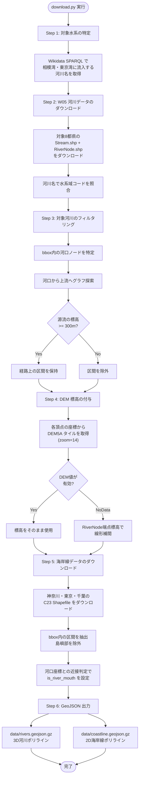

# zomia

相模湾・東京湾に注ぐ河川水系と海岸線の3Dビューア。

## 操作方法

ブラウザで `index.html` を開いてください（ローカルHTTPサーバー経由）。

| 操作 | 動作 |
|------|------|
| 左ドラッグ | 回転 |
| 右ドラッグ | パン |
| マウスホイール | ズーム |
| 標高スケール スライダー | 標高の誇張倍率を変更（1x〜50x） |
| 端点表示 チェックボックス | 河川の分岐・合流点の表示/非表示 |
| 海岸線表示 チェックボックス | 海岸線の表示/非表示 |

## データ著作権

本アプリが使用するデータは以下の出典に基づいています。

- 河川データ: 国土交通省「[国土数値情報（河川データ）](https://nlftp.mlit.go.jp/ksj/gml/datalist/KsjTmplt-W05.html)」を加工して作成
- 海岸線データ: 国土交通省「[国土数値情報（海岸線データ）](https://nlftp.mlit.go.jp/ksj/gml/datalist/KsjTmplt-C23.html)」を加工して作成
- 標高データ: [国土地理院](https://www.gsi.go.jp/)「数値標高モデル（DEM5A）」を加工して作成
- 水系情報: [Wikidata](https://www.wikidata.org/) を利用

各データは「[公共データ利用規約（第1.0版）](https://www.digital.go.jp/resources/open_data/public_data_license_v1.0)」に基づき利用しています。

## 開発者向け

### ダウンロード・解析

#### 要件

- Linux / WSL2
- Python 3.10+
- `pyshp` パッケージ (`pip install pyshp`)

#### 方法

```bash
python3 download.py
```

以下のデータが `data/` に出力されます:

- `data/rivers.geojson.gz` — 対象河川の3Dポリライン（gzip圧縮GeoJSON）
- `data/coastline.geojson.gz` — 海岸線の2Dポリライン（gzip圧縮GeoJSON）

キャッシュは `cache/` に保存され、2回目以降の実行は高速です。

#### download.py フローチャート



### ファイル構成

```
index.html              Web アプリ (HTML)
index.js                Web アプリ (JavaScript, WebGL描画)
style.css               Web アプリ (CSS)
download.py             ダウンロード・解析スクリプト
data/
  rivers.geojson.gz     河川 3D ポリライン (gzip)
  coastline.geojson.gz  海岸線 2D ポリライン (gzip)
cache/                  API レスポンスキャッシュ
  w05/                  国土数値情報 河川データ
  c23/                  国土数値情報 海岸線データ
  dem/                  国土地理院 DEM5A タイル
  wikidata/             Wikidata SPARQL レスポンス
logs/                   実行ログ
docs/
  spec.md               仕様書
  spec-download.md      ダウンロードアプリ詳細仕様
  spec-preview.md       プレビューアプリ詳細仕様
  test-spec.md          テスト仕様書
  test-report.md        テスト結果レポート
test/
  white/                ホワイトボックステスト
  blackbox/             ブラックボックステスト
```
